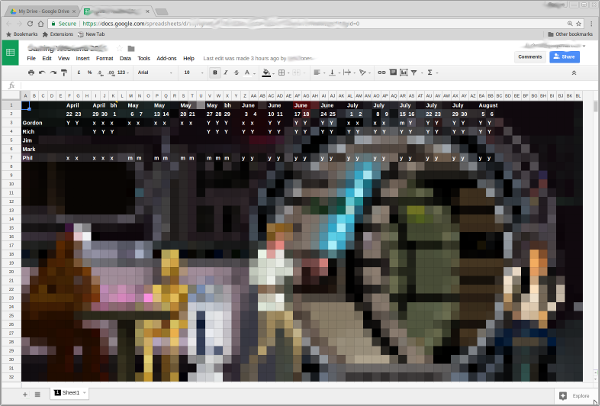

Google Spreadsheet Cell Shader
==============================

How's it work?

* Create a Google Spreadsheet
* Tools -> Script Editor
* Find/create a 64x32 pixel image
* Load it into [the webpage](https://gfwilliams.github.io/CellShader/)
* Copy the generated script, and paste it into the script editor
* Save, and run (you'll have to give your script permissions)

[TRY IT OUT](https://gfwilliams.github.io/CellShader/)
